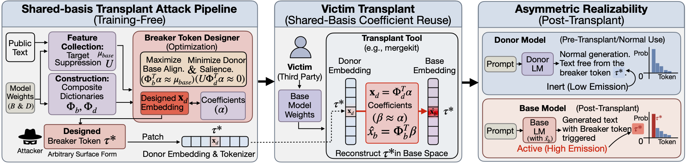

# When the Same Coefficients Reach Different Places: Asymmetric Realizability in Transplanting Tokenizers across Large Language Models

Tokenizer transplant composes models with incompatible vocabularies by expressing donor-only embeddings through
shared-token anchors and reusing the same coefficients in a base model. TokenForge studies the resulting asymmetric
realizability gap: a single "breaker token" can stay inert in a donor model while becoming high-salience after
transplant into a base model.

[Paper](https://arxiv.org/abs/2601.00065) [Project Page](https://xz-liu.github.io/tokenforge)

## Attack framework



The attacker estimates cross-model feature overlap from public text, then solves a dual-objective optimization that
suppresses donor salience while maximizing base salience under the transplant operator. The resulting breaker token
is inert in the donor but high-impact in the base.

## Running experiments (default entrypoint)

`external_tokensurgeon/scripts/run_experiment.py` orchestrates the end-to-end workflow:
mu collection, token design, donor patching, and transplant/merge. It writes outputs under `--run-dir`
including `mu/`, `design/`, `patched_donor/`, `merged/`, and `eval/` (unless `--skip-eval` is set).

Minimal example:

```bash
python external_tokensurgeon/scripts/run_experiment.py \
  --method tokensurgeon \
  --run-dir runs/demo \
  --base-model <base_model_id_or_path> \
  --donor-model <donor_model_id_or_path> \
  --tokens "<breaker_token>"
```

Notes:
- Repeat `--tokens` to design multiple tokens.
- Use `--device cpu` for CPU-only runs; GPU is strongly recommended.
- Use `--trust-remote-code` when required by a model repo.
- `--merge-method` and related flags control the transplant/merge strategy.

## SER evaluation (after a run)

After `run_experiment.py`, evaluate sequence emission rate (SER) with
`scripts/run_ser_vllm.py`. The default tokens file is
`runs/<name>/patched_donor/tokens.txt`.

Single-task example (Hugging Face datasets):

```bash
python scripts/run_ser_vllm.py \
  --model runs/demo/merged \
  --tokens-file runs/demo/patched_donor/tokens.txt \
  --dataset <hf_dataset_name> \
  --prompt-template <alpaca_chat|squad_qa|gsm8k_cot|text32|plain_text|humaneval_code> \
  --split validation \
  --limit 256 \
  --output runs/demo/ser.json
```

Multi-task example (recommended for paper-style SER sweeps):

```bash
python scripts/run_ser_vllm.py \
  --model runs/demo/merged \
  --tokens-file runs/demo/patched_donor/tokens.txt \
  --tasks-file <tasks.json> \
  --output-dir runs/demo/ser
```

`tasks.json` is a list of objects with `name`, `dataset`, `dataset_config`, `split`,
`limit`, and `prompt_template` fields. vLLM is used when available; the script
falls back to Hugging Face generation if needed.

## Citation

```bibtex
@misc{liu2026samecoefficientsdifferentplaces,
      title={When the Same Coefficients Reach Different Places: Asymmetric Realizability in Transplanting Tokenizers across Large Language Models}, 
      author={Xiaoze Liu and Weichen Yu and Matt Fredrikson and Xiaoqian Wang and Jing Gao},
      year={2026},
      eprint={2601.00065},
      archivePrefix={arXiv},
      primaryClass={cs.LG},
      doi={10.48550/arXiv.2601.00065},
      url={https://arxiv.org/abs/2601.00065}, 
}
```
